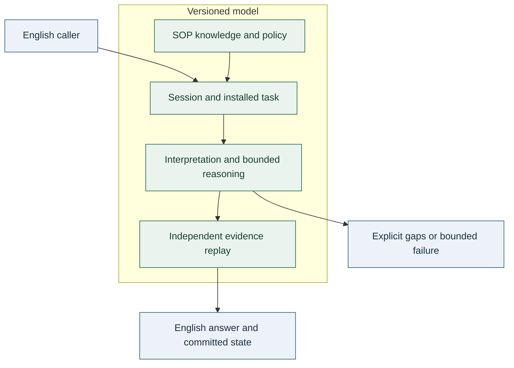

## Introduction

[SOP](../wiki.html#definition-sop) gives [pack](../wiki.html#definition-pack) authors one inspectable representation for executable model programs and structured artifacts. The [VM](../wiki.html#definition-vm) must validate dependencies and types before installation and preserve those contracts during execution.

## Core Content

### Source profiles

Executable [SOP](../wiki.html#definition-sop) modules must declare named inputs, single-assignment producers and one output. Inputs use `any`, `object`, `array`, `string`, `number` or `boolean`. Scalar literals and wire references are permitted. Record and sequence constructors expand into explicit graph dependencies. Forward references may resolve through topological compilation; duplicate producers, undefined references and cycles must fail, including malformed unused producers.

Installed [packs](../wiki.html#definition-pack) must carry executable sources in `sop`. A persistent `circuits` graph-object field is prohibited. The typed compiler graph is a transient compiler product. Metadata must not override graph inputs, nodes, schema or output. Static module dependencies must resolve before execution; candidate modules must not evaluate JavaScript or dynamically load source.

Constructor-only [SOP](../wiki.html#definition-sop) must encode structured inputs, outputs, training cases, [receipts](../wiki.html#definition-receipt), registry data and snapshots. Its reader may construct records, sequences and scalars and quote module source. It must not call installed [circuits](../wiki.html#definition-circuit), execute arbitrary operations, read files or install code. Source quotations use an exact UTF-16 length and acquire executable meaning only through separate [pack](../wiki.html#definition-pack) installation. Expansion, nesting and source size must be bounded.

### Control and types

Calls, maps, folds, choices, attempts and [guarded iteration](../wiki.html#definition-guarded-iteration) must use static compiled targets with declared contracts. All possible targets contribute to [execution identity](../wiki.html#definition-execution-identity). A choice must execute only its selected branch. A fold or map must validate callback bindings and returned values.

`iterate` must carry a seed, a state parameter, a boolean guard, a typed body and a finite safe nonnegative bound. The guard and body must have compatible inputs, and the seed must satisfy the state contract even if no transition runs. A false guard returns the state. A true guard at the bound raises resource exhaustion. Each transition produces a new immutable state; iteration does not introduce backward wires or recursive module installation. An impure guard prevents aggregate caching.

`attempt` may return an ordinary failure as inert data. It must propagate resource exhaustion. A fallback must not convert an unfinished computation into success or a logical negative result.

### Values, ownership and caching

The [VM](../wiki.html#definition-vm) must accept only inert finite values. Functions, accessors, non-plain prototypes, symbols, hidden properties, sparse or decorated arrays, unsafe record keys, undefined and nonfinite numbers must be rejected. Public inputs and native results must be copied into owned immutable values without freezing caller-owned objects. Public outputs must be detached copies. Internal sharing is permitted only for recursively owned frozen values.

[Execution identity](../wiki.html#definition-execution-identity) must preserve record enumeration order and signed zero. Cache keys must bind the complete compiled program, native versions, nested dependencies, node identity and resolved arguments. [Structural equality](../wiki.html#definition-structural-equality) may normalize record order and signed zero; it must not replace [execution identity](../wiki.html#definition-execution-identity) where later computation can observe those distinctions. DS009 governs source and model identity.

### Composition and bounds

[Provider](../wiki.html#definition-provider) [linkage](../wiki.html#definition-linkage) must compile ordered [providers](../wiki.html#definition-provider), a seed and a reducer into ordinary call nodes. [Provider](../wiki.html#definition-provider) order and contents must enter identity. Unknown [providers](../wiki.html#definition-provider), incompatible contracts and identifier redefinition must fail. One [linkage](../wiki.html#definition-linkage) is limited to 127 [providers](../wiki.html#definition-provider) by the 256-node graph limit. The contract does not promise unbounded flat [linkage](../wiki.html#definition-linkage).

Default request [budgets](../wiki.html#definition-budget) are 100,000 nodes, 200,000 steps, 12,000 facts, 100,000 matches, 12,000 tokens and 3,000 milliseconds. Limits are cooperative within trusted implementations, not operating-system resource isolation or hard real-time guarantees. Cache hits must consume the enclosing operation's accounting. Installation has a separate bounded execution report. DS010 defines task-specific error behavior and operational limits.

### Evidence and boundaries

`test/kernel.test.mjs`, `test/sop.test.mjs`, `test/sop-artifacts.test.mjs`, `test/iteration.test.mjs` and `test/identity.test.mjs` check graph, value, control and identity contracts. Historical expression compilation must reproduce full graph families without adding a second interpreter. These checks do not establish that authored model knowledge was learned or that every native operation satisfies DS000.

<!-- chapter:architecture -->
### Architecture and contracts

[SXLM](../wiki.html#definition-sxlm) connects supported English input to inspectable answers through one versioned [circuit](../wiki.html#definition-circuit) library. The normative contracts are [DS000](../specsLoader.html?spec=DS000-vision.md) and [DS002](../specsLoader.html?spec=DS002-sop-runtime.md), together with the binding theory in [vision contract](DS000-vision.md). This page explains the execution responsibilities and their limits. Authored policies and unreviewed native text/chart mechanisms exclude a claim that the complete host is general or the whole model learned.

#### The model is a library of executable data

[SXLM](../wiki.html#definition-sxlm) separates mechanisms from knowledge. The trusted runtime provides generic operations. A model consists of versioned [circuit](../wiki.html#definition-circuit) [packs](../wiki.html#definition-pack) that reconstruct [grammar](../wiki.html#definition-grammar), lexical entries, explicit relational theories, realization resources and remembered text. Raw [grammar](../wiki.html#definition-grammar), theory, text-configuration and corpus fields are rejected; sources remain offline learning evidence.



The reasoning entrypoint is itself an installed [circuit](../wiki.html#definition-circuit). Summary and completion entrypoints are also [pack](../wiki.html#definition-pack)-defined [circuits](../wiki.html#definition-circuit) over generic algorithms. New [packs](../wiki.html#definition-pack) can compose the installed operation vocabulary; genuinely new general primitives require normal reviewed code changes with contract tests.

#### Circuit machine

`sxlm.circuit.v1` has named typed inputs, an ordered acyclic node graph, and one output reference. A node invokes a registered primitive (`op`), a compiled [circuit](../wiki.html#definition-circuit) (`call`), a bounded [circuit](../wiki.html#definition-circuit) mapping (`map`) or a statically enumerated [circuit](../wiki.html#definition-circuit) choice (`choose`). References must be defined earlier and satisfy the callee's declared types. Branch contracts must agree; mapping checks callback inputs at runtime. All possible callees are compiled dependencies. There is no dynamic source evaluation.

Primitives receive owned, recursively frozen inert values. Public inputs and native outputs are copied without freezing objects owned by their callers; immutable owned subtrees can be shared internally. Public outputs are detached copies. The runtime rejects functions, special prototypes, accessors, hidden/symbol properties, sparse or decorated arrays, dangerous keys, undefined and nonfinite numbers. Structural evidence uses canonical SHA-256 digests. Executable program/[pack](../wiki.html#definition-pack)/cache identities preserve property order and signed zero because record operations can observe them. The complete installed model also binds its static host sources and Node component versions. Cache keys include the full compiled [circuit](../wiki.html#definition-circuit) content, primitive versions, nested-[circuit](../wiki.html#definition-circuit) hashes, node identity and resolved argument values. A [circuit](../wiki.html#definition-circuit) ID cannot be rebound to different content within one model. Different specializations therefore cannot share cached constant values accidentally.

Semantic actions execute ordinary value nodes, calls, choices, maps and folds. The offline compiler lowers historical field/default access, lexical bindings, lazy control, iteration and formatting to that graph. No deployed primitive receives an expression AST or a formatting program. The constructor-only [SOP](../wiki.html#definition-sop) reader returns inert data, including operator-shaped records. The [lowering contract](DS002-sop-runtime.md) defines preserved behavior and migration limits.

Default [budgets](../wiki.html#definition-budget) bound [circuit](../wiki.html#definition-circuit) nodes, chart work, inference matches, derived facts, tokens and elapsed time. These are cooperative limits within the trusted implementation. They are not operating-system memory isolation or a hard real-time guarantee. Source sizes, per-segment token count, [grammar](../wiki.html#definition-grammar) size, lexical regex structure and inert value nesting have separate bounds.

#### Grammar and semantics

The Earley parser consumes an immutable [grammar](../wiki.html#definition-grammar) reconstructed by [circuit](../wiki.html#definition-circuit) execution. Its terminal types are literal tokens, lexical categories and constrained single-token character classes. Left recursion and compositional category reuse are supported. Productions execute semantic [circuits](../wiki.html#definition-circuit) over their child meanings. Complete interpretations are deduplicated by execution-observable identity, preserving record order and signed zero. Distinct remaining meanings produce an explicit ambiguity gap; the parser does not choose an interpretation based on which answer looks convenient.

Lexical patterns permit only one to four character classes with at most one variable repetition. They do not permit arbitrary regex alternation, groups, lookarounds, backreferences, or chains of overlapping repetitions. This keeps [pack](../wiki.html#definition-pack)-supplied token classification from introducing uninterruptible regex backtracking.

The [bootstrap](../wiki.html#definition-bootstrap) [grammar](../wiki.html#definition-grammar) constructs these instructions:

- `assert`: grounded signed [atoms](../wiki.html#definition-atom);
- `rule`: conjunctive premises and one or more conclusions;
- `query`: a typed truth, selection, quantity or arithmetic request;
- `quantity`: ordered assignment, addition, subtraction or transfer events.

[Atoms](../wiki.html#definition-atom) carry `predicate`, ordered `terms`, explicit `negative` polarity and `context`. The [bootstrap](../wiki.html#definition-bootstrap) language uses `?subject` as a compositional hole; combining a noun phrase and a verb phrase substitutes that subject throughout the semantic fragment. Indefinite noun phrases contribute a fresh referent and a type constraint. In a rule premise, those referents become bound variables; in factual assertions, they remain distinct source-scoped witnesses. Existential rule conclusions and negative existential assertions are rejected rather than incorrectly approximated.

The same mechanism composes `Every pilot who owns a bird is careful` from a type restriction and two verb phrases. No code branch recognizes that sentence, `pilot`, `bird`, `Mira`, or any other example vocabulary.

#### Logical contract

The inference engine computes a finite, range-restricted signed Horn closure. Rule joins preserve shared variable bindings and argument order. Recursive rules are legal over the finite active domain. Rules cannot cross contexts implicitly. There is no negation by failure, contrapositive inference, closed-world default, or explosion from contradictions.

For a grounded atomic query, positive and negative support produce `true`, `false`, `both` or `unknown`. Existential conjunctions use supported witnesses; a negative instance is not incorrectly taken as the negation of an existential proposition. Selection answers are known supported values, not a certified exhaustive list of all real-world values.

The [bootstrap](../wiki.html#definition-bootstrap) spatial/kinship theory is explicit [pack](../wiki.html#definition-pack) knowledge: inverse relations, selected transitive relations, and parent-to-ancestor inclusion. This is a finite relational model, not a complete physical spatial solver. Users can inspect its provenance in rule evidence.

#### Evidence and transactions

Original text is retained under a content digest. Evidence spans are exact half-open UTF-16 offsets. Each derived [atom](../wiki.html#definition-atom) records its rule, substitution and premises. Results include a bounded display tree and a full reachable proof DAG. An independent checker replays the DAG against asserted facts, rules and source hashes before the [session](../wiki.html#definition-session) commits. This checks formal entailment from the interpreted representation; it does not certify that the parser captured every nuance of the source language.

Questions within a narrative observe the state at their position. The complete turn is first evaluated on copied state. A failure or exhausted [budget](../wiki.html#definition-budget) leaves the previous state unchanged. Supported statements and unsupported statement gaps may coexist in a successfully processed turn; gaps remain visible. A question that fails to parse does not become a state-changing world event.

Numeric state uses exact rational arithmetic. A transfer out of a known inventory does not require the recipient's initial total. The recipient's total stays unknown with a known delta. Unsupported statements mentioning an owner taint that owner's existing quantities; they do not invalidate an unrelated owner's exact total. An explicit later assignment resets that quantity's history. Negative inventory is treated as an inconsistent state result. Events follow narrative order; no general tense/aspect/time model is claimed.

#### Summary and completion contract

Summaries select original sentence spans using configurable centrality, focus, lead and redundancy scores. They retain negation and wording because the selected text is copied exactly. This gives a strong source-fidelity guarantee but cannot repair ambiguity, falsehood or unresolved reference in the source, and does not provide abstractive synthesis.

Completion first finds attested source continuations. Otherwise [SOP](../wiki.html#definition-sop) performs deterministic backoff over frequencies induced offline and compiled into [circuit](../wiki.html#definition-circuit) pages. Each page constructs its observed values when executed. Multiple sequence [packs](../wiki.html#definition-pack) contribute through typed static [linkage](../wiki.html#definition-linkage); no corpus is read or counted by model construction. It reports whether the result is attested or only distributional. A generated sequence is never a logical proof, and no truth status is inferred from its frequency. With no useful [context](../wiki.html#definition-context), it abstains. Larger corpora expand [coverage](../wiki.html#definition-coverage); they do not automatically create new semantic reasoning skills.

#### Independence and extension boundaries

The implementation uses only Node built-ins and repository-owned files. No imports, symlinks, runtime calls, or copied source dependencies connect it to the earlier experiments. Their useful design lessons informed these contracts; they are not runtime dependencies.

New linguistic knowledge enters through [circuit](../wiki.html#definition-circuit)-compiled [grammar](../wiki.html#definition-grammar) and [lexicon](../wiki.html#definition-lexicon) proposals. New domain rules enter through `compileTheoryKnowledge`, which emits signed relational theory constructors and [provider](../wiki.html#definition-provider) wiring. New corpus text is consumed by offline learning to produce executable sequence memory. New solver capabilities should use an explicit semantic IR and independently checkable witness. Avoid expanding the trusted kernel merely to recognize another surface phrase.

[SOP](../wiki.html#definition-sop) compiles to the same typed IR and preserves dependency content hashes. Its ordinary graph nodes make scoring and control visible. The default node [budget](../wiki.html#definition-budget) is 100,000: lowering the former expression interpreter exposed roughly 25,000 graph nodes for a 19-node proof, and [SOP](../wiki.html#definition-sop) lexical and segmentation policy brings that request to about 92,800 nodes without caching. This reflects execution accounting, not a gain in language ability or asymptotic efficiency. Explicit caller limits, token/step limits and the wall-time [budget](../wiki.html#definition-budget) remain enforced.

#### Document policy and native parsing boundary

The document entrypoint reconstructs [grammar](../wiki.html#definition-grammar) metadata, segments the source, invokes `kernel.chart.parse` per span, checks interpretation status and attempts [circuit](../wiki.html#definition-circuit) lowering. Successful instructions retain span/derivation metadata; unparsed, ambiguous or invalid meanings become explicit gaps. Label collection, query-marker policy and [coverage](../wiki.html#definition-coverage) calculation are [SOP](../wiki.html#definition-sop) programs. The remaining chart primitive captures an immutable [grammar](../wiki.html#definition-grammar) produced by `language.grammar`; its recognition, terminal and semantic-action scheduling contract remains under review. Its identity binds the complete model and static runtime.

The [VM](../wiki.html#definition-vm)'s program, primitive, type and cache registries are private. Inspection getters return detached maps; primitive contracts and compiled programs are frozen. [Grammar](../wiki.html#definition-grammar) source data and production arrays are frozen, and indexes are private. Direct edits to inspection results cannot change execution. The installed runtime and model are sealed. Model and [circuit](../wiki.html#definition-circuit) identities bind the static host source closure and Node environment; a fresh host revision invalidates prior model snapshots. The sealed source profile and its trusted-process limitations are specified in [vision contract](DS000-vision.md).

#### Circuit-produced initialization and configuration

The `theory.bootstrap` entrypoint executes the state constructor and folds the `knowledge.theory` [providers](../wiki.html#definition-provider) through a typed installation policy. Every rule is formally validated, serialized canonically, and linked to declaration evidence. The kernel no longer inserts rules from a side table. This [bootstrap](../wiki.html#definition-bootstrap) runs once during installation under a bounded [budget](../wiki.html#definition-budget); its frozen result is copied into new [sessions](../wiki.html#definition-session). Installation [circuit](../wiki.html#definition-circuit) cost is available on `model.installation`.

`language.text-config` is the common source for summary and completion configuration. `npm run build:knowledge` rebuilds the seven authored policies, ten theory constructors and two text constructors from their archived inputs. The archive is not read at inference. `test/knowledge.test.mjs` exercises removal, extension and replacement through [circuits](../wiki.html#definition-circuit); the compilation [receipt](../wiki.html#definition-receipt) does not claim induction.

#### SOP planning and bounded control

`model.plan` executes the [pack](../wiki.html#definition-pack)'s `planning.run` entrypoint. Seventeen authored [SOP](../wiki.html#definition-sop) modules implement finite cost search; preconditions and goals reuse a separately synthesized finite-set method. A static typed `iterate` node expresses the search loop with an immutable state, boolean guard and explicit bound. The enclosing graph remains [SSA](../wiki.html#definition-ssa) and acyclic. Model code only invokes the program and replays solved witnesses against the formal transition contract. No native action-search operation remains.

The [planning contract](DS007-formal-planning.md) states the distinction between witness validity, optimality checks and unreachability. A finite-state reference oracle and method [ablation](../wiki.html#definition-ablation) exercise the composition; they do not make the authored search strategy learned. General parsing policy and complete learning derivations remain outstanding.


#### Lexical preparation and terminal policy

The chart receives explicit pure [SOP](../wiki.html#definition-sop) entrypoints for lexical preparation, tokenization and terminal matching. Seventeen policy modules construct the [lexicon](../wiki.html#definition-lexicon) index and handle literals, classes, exclusions and case choices. A separately synthesized two-operation normalization [circuit](../wiki.html#definition-circuit) processes literals, [lexicon](../wiki.html#definition-lexicon) surfaces and parser token values. Model installation accounts for index preparation; parser callbacks share execution [budgets](../wiki.html#definition-budget) and traces.

Native token boundaries, summary word [extraction](../wiki.html#definition-extraction), and Earley agenda scheduling require work. The lexical policy is authored and its [normalization method](../wiki.html#definition-normalization-method) is induced; neither distinction disappears through compilation. The standalone `Grammar` API requires a `policy` argument, with the contracts in [LEXICAL-POLICY.md](DS004-language-interpretation.md).
<!-- /chapter:architecture -->

<!-- chapter:sop -->
### Typed SOP authoring in SXLM

[SOP](../wiki.html#definition-sop) is a source frontend for the existing immutable, typed [circuit](../wiki.html#definition-circuit) graph. It is implemented independently in [SXLM](../wiki.html#definition-sxlm); it imports no other experiment. The active summary and completion strategies use this surface. Archived semantic expressions are compiled offline to this same graph; the model no longer loads an expression interpreter. See [the lowering contract](DS002-sop-runtime.md).

```sop
@input value string
@result kernel.value.record original $value
@output result $result
```

Inputs declare one of `any`, `object`, `array`, `string`, `number`, `boolean`. Values are scalar literals or `$wire` references. Quoted strings support escaped quotes, backslashes, control characters and Unicode escapes; object/array literals and JavaScript code are not executable syntax. Comments begin with `#` outside strings. Forward references are resolved by a topological compilation pass; unknown wires, duplicate producers and cycles fail.

Calls beginning with `kernel.` or `data.` name registered general primitives; other names call [circuits](../wiki.html#definition-circuit). `kernel.value.record` and `kernel.seq.make` are compiler conveniences that expand into ordinary construction nodes. They are not hidden semantic interpreters. Every field/item becomes an explicit graph dependency.

`kernel.flow.map` supplies `item` and `with` to its callback. `kernel.flow.fold` supplies `state`, `item` and `with`. `kernel.flow.choose` takes a boolean condition, two [circuit](../wiki.html#definition-circuit) names and `with`; the branches must share a contract, and only the selected branch executes. Both branch definitions contribute to the caller's content identity. Iteration, calls and cache hits use the same runtime [budgets](../wiki.html#definition-budget) as other [circuits](../wiki.html#definition-circuit).

The versioned [pack](../wiki.html#definition-pack) stores source modules in `sop`. `combinePacks` compiles them into the typed [VM](../wiki.html#definition-vm) graph. A persistent `circuits` object-graph field is rejected. `npm run build:sop` installs the working summary sources into a [pack](../wiki.html#definition-pack); `npm run check:learning` checks the installed source identity and learning reproduction. This installation is not a learning claim.

The summary library comprises 13 authored modules and one induced scoring module. The generic affine learner infers coefficients from full-rank numeric observations and rejects inconsistent or ambiguous supervision. Its output is [SOP](../wiki.html#definition-sop), so the scoring calculation has no privileged native path. `training/summary-scores.sop` records that these annotations came from the previous authored score function. It is limited distillation, not evidence of independent language understanding or automatically learned selection strategy.

The native `text.summarize` shortcut was removed. Source segmentation executes through the shared [SOP](../wiki.html#definition-sop) [text policy](../wiki.html#definition-text-policy); generic numeric/sequence operators remain native, while sentence scoring, focus use, redundancy penalties, selection and evidence construction execute through [circuits](../wiki.html#definition-circuit). The legacy native summary lives only in `test/reference/text-v1.mjs` as a differential migration oracle. Tests also cover primitive identities, source-only strategy changes, independent numeric transfer, source offsets and [budgets](../wiki.html#definition-budget).

Resource accounting changed because the selection work is visible as graph nodes: the default node [budget](../wiki.html#definition-budget) is 100,000 after the lexical migration. A 20-sentence cold-cache regression checks ordinary document capacity and an explicit 1,000-node limit stops execution. This is an accounting adjustment, not a claim of improved asymptotic complexity.

#### Circuit memory and provider linkage

`npm run build:completion` reconstructs the completion policy and offline learned [bootstrap](../wiki.html#definition-bootstrap) memory. Generic memory compilation places related constructors in bounded DAGs, shares repeated subvalues and routes finite-function lookups to a selected page. Pages use `data.attach`, sequence constructors and explicit field access; there is no native decoder for an embedded knowledge language. Stored raw text is training evidence; remembered text at inference is a [circuit](../wiki.html#definition-circuit)-produced value.

A [pack](../wiki.html#definition-pack) may declare `providers`, an ordered mapping from a named slot to [circuit](../wiki.html#definition-circuit) IDs, and `linkages`, an array of `{id, slot, seed, reducer}`. The static linker emits ordinary call nodes. [Providers](../wiki.html#definition-provider) and seed accept `{with: object}`; reducers accept `{state, item, with}` with compatible declared types. Order and dependency contents enter the resulting [circuit](../wiki.html#definition-circuit) identity. Unknown [providers](../wiki.html#definition-provider), type mismatches and redefinitions fail compilation. A [linkage](../wiki.html#definition-linkage) supports at most 127 [providers](../wiki.html#definition-provider) under the 256-node limit; hierarchical linking and larger-corpus source retrieval remain work to do. This is a generic module-composition mechanism, not dynamic JavaScript dispatch.

The completion policy is authored; observed frequencies are induced; original sources and the [context](../wiki.html#definition-context) bound are remembered. `npm run check:learning` and `npm run audit:vision` verify those distinctions and replay exact artifacts.

#### Attempt and document interpretation

```sop
@input value any
@result kernel.flow.attempt circuit "document.lower-array" value $value
@output result $result
```

`attempt` binds the target's normal typed arguments and returns an object: `{ok:true, value}` or `{ok:false, error:{name,message}}`. The target is static and its dependencies affect the caller's hash. Resource exhaustion propagates; it cannot be converted to a successful answer by a fallback. Ordinary failures are data, and the caller chooses their meaning. Failed calls may have populated pure caches, but cannot mutate model state.

`npm run build:document` installs 19 authored document/[grammar](../wiki.html#definition-grammar) policies and 40 constructor modules for the authored [bootstrap](../wiki.html#definition-bootstrap) [grammar](../wiki.html#definition-grammar). The former native document interpreter is retained only as a differential test oracle. The public `parseDocument` adapter delegates to `document.run`; custom lowering is bound by the installed [circuit](../wiki.html#definition-circuit), and the old `lowering` adapter option is rejected explicitly.

Each builder preserves unrelated [provider](../wiki.html#definition-provider) slots and [linkages](../wiki.html#definition-linkage). The completion and [grammar](../wiki.html#definition-grammar) libraries therefore coexist under the same typed module-composition contract. [Grammar](../wiki.html#definition-grammar) recognition itself remains a native accelerator under review, rather than being certified merely by this representation change.

The `kernel.relation.validateRule` primitive validates the existing finite signed relational contract; its namespace exposes that same reviewed mechanism to [SOP](../wiki.html#definition-sop). Theory installation policy is in `sop/theory/`. `kernel.value.encode` produces canonical [SOP](../wiki.html#definition-sop) with recursively sorted record keys and signed-zero normalization for [structural equality](../wiki.html#definition-structural-equality). Execution identities remain order-sensitive because record enumeration and serialization can observe property order.

#### Explicit SSA nodes

The general surface covers every [VM](../wiki.html#definition-vm) control form, including arbitrary callback parameter names:

```sop
@input items array
@sum fold "sum-step" items $items item "entry" state "total" seed 0 bind offset 0
@output result $sum
```

`primitive "name" bind ...`, `call "name" bind ...` and `attempt "name" bind ...` explicitly distinguish native operations, normal calls and captured ordinary failures. `map "name" items $items item "parameter" bind ...` binds an item; `fold` also declares an accumulator and seed. `choose selector $label otherwise "fallback" case "key" "branch" bind ...` uses a string selector and static branch targets. All branch definitions enter content identity; only the selected branch executes. Bindings are ordinary name/value pairs. Forward references are allowed, but cyclic graphs are rejected.

The offline `graphToSOP` printer produces these declarations and expands nested constants into records and sequences. It preserves literal property order, signed zero, binding roles and lazy control. It does not emit an embedded graph object or an expression interpreter call.

#### Guarded iteration and SSA

```sop
@input start number
@input target number
@input bound number
@done iterate "advance" while "pending" state "current" seed $start limit $bound bind target $target
@output result $done
```

The body `advance` and guard `pending` must be separately installed [circuits](../wiki.html#definition-circuit) with the same input contract. The guard returns a boolean; the body returns the state type. The seed must satisfy both the state input and body output contracts, including when zero transitions execute. The bound must be a finite safe nonnegative integer. At state `s_i`, a false guard returns `s_i`; a true guard at the bound raises `LimitError`. Otherwise the body computes immutable `s_(i+1)`. Resource exhaustion propagates through `attempt` and never implies successful termination.

This is a structured control node: the enclosing [SSA](../wiki.html#definition-ssa) graph remains acyclic, each wire has one producer, and body/guard dependencies are static and acyclic. Iteration does not create a backward wire or allow self-recursive module installation. Both target contents enter the caller identity. Seed, arguments and bound enter the cache key; an impure guard prevents aggregate caching. A cached result can avoid inner work, as with a fold, while consuming the enclosing node's [budget](../wiki.html#definition-budget). `test/iteration.test.mjs` covers numeric, string and record states, typing, zero/exact bounds, purity and immutable state. [Finite planning](DS007-formal-planning.md) supplies a larger [circuit](../wiki.html#definition-circuit) composition.

#### Data, packages and transport

The constructor-only profile represents observations, metadata, [receipts](../wiki.html#definition-receipt) and structured results with the same scalar and wire syntax:

```sop
@required kernel.seq.make item "quartz"
@available kernel.seq.make item "copper" item "quartz"
@example kernel.value.record required $required available $available
@output result $example
```

Records also accept quoted field names. `kernel.value.literal value -0` produces a scalar output. `encodeSOP` and `decodeSOP` provide this interchange boundary in Node and the browser. The reader permits only record, sequence and scalar constructors; calls and arbitrary native operations are forbidden. Every producer is checked for uniqueness, references and acyclicity. Expansion and nesting are bounded. This restricted reader is part of the audited host closure, not an uncounted inference engine.

Packages contain readable module quotations followed by a constructor graph for their metadata. `@module source0 chars N` begins an exact `N` UTF-16-code-unit source body; a newline and `@end` close it. A value `&source0` quotes that source as inert text. The explicit length preserves final newlines and prevents a delimiter inside a program from closing the quotation. Module quotations acquire executable meaning only through [pack](../wiki.html#definition-pack) installation and typed compilation. No source string can override the compiled graph through metadata.

Files use `.sop`. The CLI uses `--sop` for structured results and [SOP](../wiki.html#definition-sop) for training packets, candidates, gates and registry history. HTTP endpoints require and return `application/sop`. The workbench edits and downloads this format. Plain natural-language CLI output remains plain text.

`kernel.value.serialize` preserves property order and signed zero in [SOP](../wiki.html#definition-sop). `kernel.value.parse` accepts only the constructor profile. `kernel.value.encode` produces canonical [SOP](../wiki.html#definition-sop) for equality-based lookup. Formatting a scalar as language text uses `kernel.value.scalarText`; a serialized record is not a sentence.

Node's `package.json`, separately installed agent-manager metadata (`.agents`, `.claude`, `ploinky-skills-manifest.json`) and Chromium's external debugging protocol remain infrastructure formats. None carries model knowledge or intermediate inference state. The isolated build/runtime copies exclude agent-manager metadata and its compatibility symlink.

Offline builders sort module definitions by ID to make rebuild order deterministic. This does not reorder [providers](../wiki.html#definition-provider), instructions, record fields or sequence values.

Lexical preparation, terminal matching and normalization use [SOP](../wiki.html#definition-sop) entrypoints; the Unicode normalization composition has a reproduced learning derivation. [The lexical contract](DS004-language-interpretation.md) records the remaining native token boundaries and the increased visible execution cost.
<!-- /chapter:sop -->

<!-- chapter:expression-lowering -->
### One execution semantics

[SXLM](../wiki.html#definition-sxlm) installs typed graphs. [SOP](../wiki.html#definition-sop) is an authoring frontend for those graphs. The retired nested expression notation is accepted only by an offline compiler in `src/learning/expressions.mjs`; it is not a second model interpreter. New task policy should use [SOP](../wiki.html#definition-sop).

`training/legacy-circuits.sop` preserves the migration source. `npm run build:expressions` rebuilds its remaining authored roots and the realization/semantic learner outputs. `npm run check:learning` checks exact graph reproduction, including executable property order and obsolete fragment detection. `npm run test:rebuild` runs all ten build stages and checks the resulting complete [pack](../wiki.html#definition-pack) in an isolated copy.

The model import closure excludes the compiler and historical evaluator. [Pack](../wiki.html#definition-pack) validation rejects raw graph installation; the offline compiler rejects unlowered interpreter nodes; Inert records containing keys such as `$get` remain ordinary data at inference time. A coding agent submits [SOP](../wiki.html#definition-sop) modules through the normal validation and [promotion](../wiki.html#definition-promotion) path.

#### Lowering contract

- Static constants are inert graph literals. A record shaped like a wire reference is constructed explicitly, preserving its data meaning.
- Ordered local bindings become record construction nodes. Nested bindings and iteration shadow only their lexical environment.
- Conditionals, short-[circuit](../wiki.html#definition-circuit) booleans and missing-value fallbacks execute through lazy graph choices. A failing unselected branch does not run.
- Mapping/filtering become bounded graph iteration with explicit element/index bindings. Scoped symbol construction includes the nested iteration path; equal names in distinct scopes remain distinct under the hash contract.
- Formatting patterns are parsed offline into field reads, scalar conversion and concatenation. Dynamic format programs are rejected and require explicit [circuit](../wiki.html#definition-circuit) composition. Literal replacement is not regular-expression evaluation.
- Categorical equality chains can lower to one static choice. Common subexpressions can share nodes within the same lexical environment. These are compiler optimizations, not learned abstractions.
- Every graph family binds its source and compiler hashes. Roots preserve their learning/provenance evidence, and generated fragments inherit it. Authored source remains authored after compilation.

`learnExpression` and `learnDispatch` return `circuits` plus the final `circuit` root and a learning [receipt](../wiki.html#definition-receipt). Convert and install the entire family with `modulesFromGraphs` under `pack.sop`. Raw graph installation is rejected. The root alone may call generated helpers. [Construction induction](../wiki.html#definition-construction-induction) also emits complete lowered families and quotes expression-shaped semantic constants.

The historical evaluator exists only as `test/reference/template-v1.mjs`, a differential migration oracle. Operator-family tests compare it with cold, warm and uncached graph execution, then separately test scope, lazy failure, invalid data, [budgets](../wiki.html#definition-budget) and inert constants. That oracle provides compatibility evidence; it is not an independent proof of natural-language correctness.

#### Value ownership and identity

Public inputs are validated inert data and copied into the [VM](../wiki.html#definition-vm). A primitive receives owned frozen arguments. A native result is validated and copied before retention, so execution never freezes externally owned return objects. Public outputs are detached from internal/cache state. Immutable subtrees can be shared only after recursive ownership has been established by the data module.

Executable identity uses type-separated Merkle hashing with the `sxlm.execution.v3` domain. It preserves record enumeration order and signed zero. Memoized subtree hashes and depths are valid only for the module's recursively frozen values. A shallow `Object.freeze` on a caller's object is insufficient. Moving an already validated subtree deeper must enforce the data nesting limit.

[Structural equality](../wiki.html#definition-structural-equality), [SOP](../wiki.html#definition-sop) serialization and executable identity have distinct contracts. Normal [SOP](../wiki.html#definition-sop) serialization preserves record order and signed zero. Canonical [SOP](../wiki.html#definition-sop) encoding sorts keys and normalizes signed zero for equality-based lookup. Executable identity remains order-sensitive and sign-sensitive. The graph printer expands literal collections into explicit constructor producers; source replay checks the installed compiled [SOP](../wiki.html#definition-sop), not the pre-printing graph.

Chart deduplication follows the same observational identity: two intermediate meanings with different record order or signed zero remain separate when later [circuits](../wiki.html#definition-circuit) can distinguish them. A regression composes lexical alternatives through two semantic actions and checks both cold and warm execution, [lexicon](../wiki.html#definition-lexicon)-order changes and genuinely identical duplicates. This closes one parser composition defect; it does not approve the complete native chart mechanism.

#### Accounting and remaining work

The migration exposes work previously hidden inside one native call. After the subsequent lexical migration, the normal node [budget](../wiki.html#definition-budget) is 100,000, with an unchanged cooperative three-second wall-time [budget](../wiki.html#definition-budget). Caller limits apply, including cache hits. The 19-node proof regression checks default-[budget](../wiki.html#definition-budget) success and explicit-[budget](../wiki.html#definition-budget) rollback; the number of proof nodes is not the number of execution nodes.

The archived 131 root programs contain 188 retired calls and lower to 603 modules. The complete installed library has additional [SOP](../wiki.html#definition-sop) programs and [provider](../wiki.html#definition-provider) links. Compiler fragments must not be counted as newly learned skills.

This migration removes one opaque execution path. It does not learn the authored [bootstrap](../wiki.html#definition-bootstrap), validate native chart strategy, establish complete truth maintenance, or solve the open-language challenges. The next capability experiment must demonstrate learned composition with a frozen host and held-out combinations, as required by `docs/specs/DS000-vision.md`.
<!-- /chapter:expression-lowering -->
